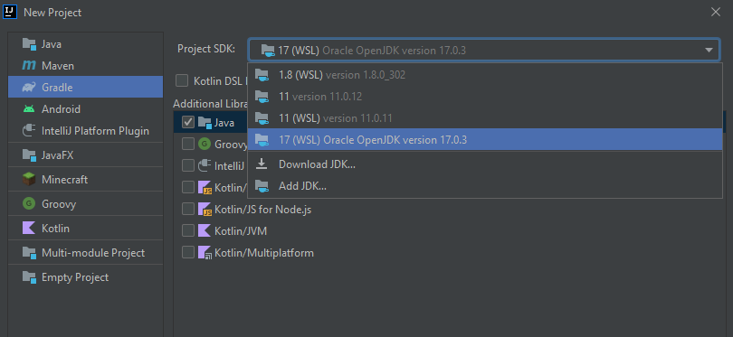

# Windows WSL + SDKMAN + Intellij IDEA

## Installation + Project Setup

1. Install Intellij IDEA on Windows. If prompt, enable all related WSL options:

2. Install SDKMAN on WSL system **(It is important to NOT have any Java version installed)**:

```bash
sudo apt-get update
sudo apt-get install curl zip unzip
```

```bash
curl -s "https://get.sdkman.io" | bash
```

3. Restart terminal to reload SDKMAN path and environmental variables.

4. Install desired Java versions using SDKMAN:

```bash
sdk install java 17.0.3-oracle
```

5. Open Intellij and create a new project. The new JDK should be automatically detected (WSL). If not, try using `Add JDK...` to make Intellij autodiscover new installed JDKs.


